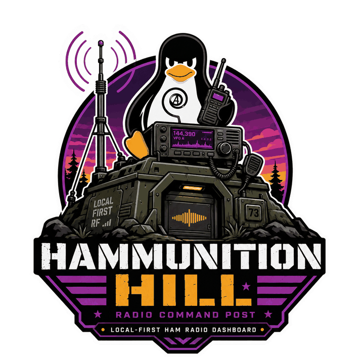

# Branding

The logo, the mark, the palette, and the rules for using them. Everything here
lives in [`brand/`](../brand) except the logo itself, which is in
[`docs/images/`](images) because the README uses it.

---

## The logo

  

A bunker on a hill with a guyed lattice antenna, a mobile rig showing 144.390,
a handheld, and Tux wearing the circle-A. The penguin is the author's own mark
and is meant to be there.

| File | Use |
|---|---|
| [`docs/images/logo.png`](images/logo.png) | 720 px, transparent. The primary logo. |
| [`docs/images/logo-256.png`](images/logo-256.png) | 256 px, for anywhere the full file is wasteful. |
| [`brand/logo-original-monogram.png`](../brand/logo-original-monogram.png) | The artwork as first drawn, with **HH** on the bunker hatch. Superseded; kept so the change is on the record. |

### Why the hatch changed

The first artwork carried an **HH** monogram on the bunker's hatch, and the
first header mark was that monogram on its own.

**HH**, standing alone in heavy letterforms, is a recognised white supremacist
abbreviation — the [ADL's hate symbol database](https://www.adl.org/resources/hate-symbol/hh)
lists it alongside 88. In the full illustration it is one small element among a
dozen, and context does most of the work. Reduced to a favicon it is the *only*
element, stripped of everything that would otherwise disambiguate it, and a
project named Hammunition Hill does not get to be surprised when someone makes
that joke.

So the hatch carries a waveform instead — which echoes the spectrum display on
the rig directly above it — and the mark is the antenna, not the letters.

## The mark

Used at 26 px in the dashboard header and as the favicon. It is the guyed mast
on the hill against the sunset disc, taken from the logo's own composition.

| File | Use |
|---|---|
| [`brand/mark.svg`](../brand/mark.svg) | Two colour, for dark backgrounds. Also served as `web/mark.svg`. |
| [`brand/mark-light.svg`](../brand/mark-light.svg) | For light backgrounds: the mast goes white. |
| [`brand/mark-mono.svg`](../brand/mark-mono.svg) | One colour, inherited. Screen printing, vinyl, laser, embroidery. |
| `brand/favicon-{16,32,48}.png`, `brand/apple-touch-icon.png`, `brand/icon-512.png` | Rasterised from `mark.svg` by a real browser. |
| [`brand/social-preview.png`](../brand/social-preview.png) | 1280×640, for GitHub's repository social preview. |

It is **not a shrunk logo**. The full illustration has an antenna, guy wires, a
rig with a button row and a waveform, a bunker and a penguin, and at 26 px all
of that is mud. A mark that works small is a different drawing with the same
identity.

Three things were found by rendering it rather than by reasoning about it, and
are worth not rediscovering:

- The hill **must** be clipped to the disc, or it escapes into the corners.
- A full lattice mast loses its bracing to mush below about 24 px. The mark
  uses a plain mast with guys instead.
- `mark-mono.svg` is drawn in `currentColor`, so it is for **inlining**. Loaded
  through an `` tag it renders black, because an SVG referenced that way is
  an isolated document that cannot see the page around it. Paste the markup in,
  or set `fill` on the circle.

## Palette

Published as [`brand/palette.json`](../brand/palette.json). The two brand
colours are *sampled from the artwork*, not chosen beside it: they are the two
most common chromatic values in the logo file.

| Token | Hex | |
|---|---|---|
| `brand` | `#912795` | The sunset purple. |
| `brand-ink` | `#ed9a1c` | The amber. |
| `brand-deep` | `#481050` | The shadow tone under the purple. |

The dashboard's surface and status ramps are in the same file so that anything
made off this package matches the product. `web/style.css` is the source of
truth for those, and `tests/test_brand.py` keeps the two in step.

### The accent is the brand purple, lightened

The dashboard accent is `#dc7be0`, not `#912795`. That is not a different
colour chosen for variety: it is the same hue (298°), raised in lightness until
it is legible.

`--accent` is **text** — active tabs, links, callsigns, band labels — and it is
also a fill with `--ground` written on top. The logo purple measures **2.62:1**
against the dashboard ground, which fails the 3:1 floor for interface
components and is nowhere near the 4.5:1 for text. Painting the dashboard in it
would have been a readability regression made for brand reasons.

At 298° the trade is real and worth stating: reaching the old cyan's 9.1:1
turns the colour pink before it gets there. `#dc7be0` sits at **7.1:1**, which
clears AA for text and AAA for large text while still reading as the logo's
purple.

`tests/test_contrast.py` measures every foreground token against every surface
and fails below its floor. It also asserts that `--brand` is *not* used as a
text colour, so the unreadable one cannot quietly become one on the grounds
that it is "the brand colour".

## Using it

- Keep clear space around the mark of at least a quarter of its width.
- Do not recolour it outside the palette above; use `mark-mono.svg` when you
  only have one ink.
- Do not stretch it. The mark is square and the logo is square.
- Do not put the two-colour mark on a light background — amber on purple is a
  2.4:1 contrast ratio. Use `mark-light.svg`.
- Do not rebuild the mark from the letters **HH**. See above.

## Licence

The **code** in this repository is MPL-2.0. The **logo and the mark are not
code**, and a code licence is the wrong instrument for them.

They may be used to refer to this project — in articles, talks, package
listings, a link back, a sticker on your own radio. They may not be used as the
mark of a different project, or in a way that suggests this project endorses
something it has not seen.

Fork the software freely; that is what the licence is for. Give the fork its
own name and its own mark.
